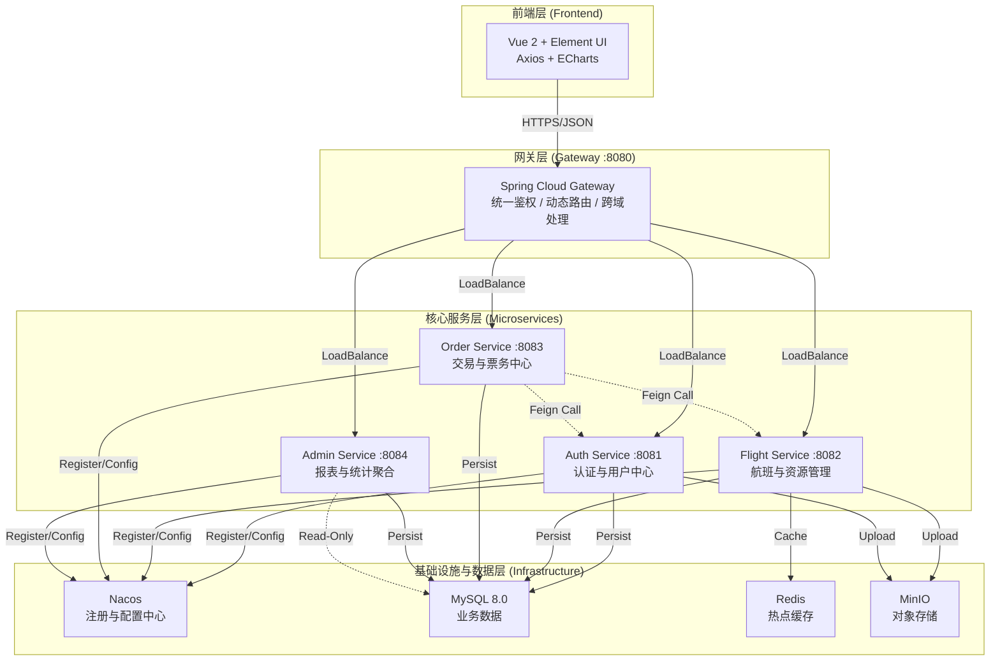
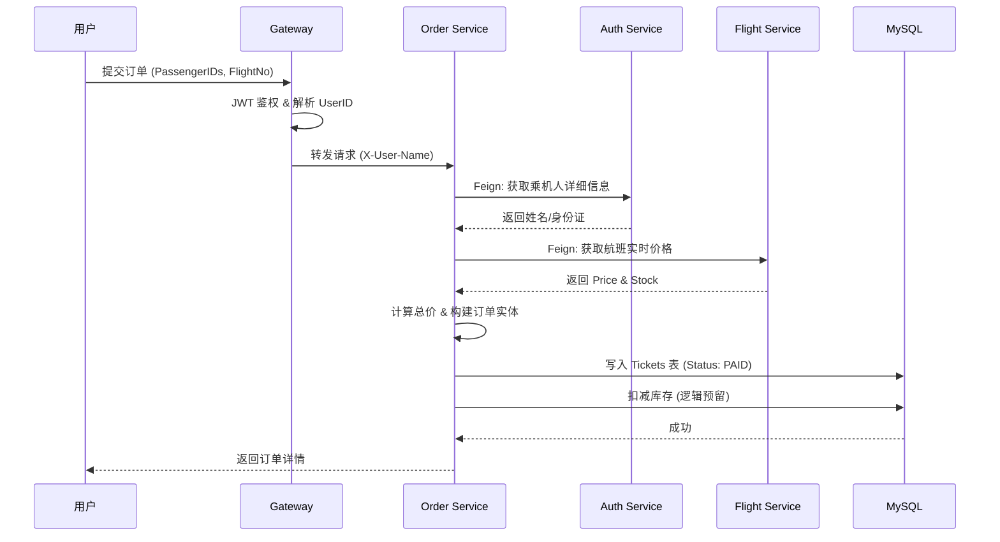

# ✈️ 蓝天航空 (BlueSky Airlines) | 分布式机票预订系统

[](https://openjdk.org/)
[](https://spring.io/projects/spring-cloud-alibaba)
[](https://vuejs.org/)
[](https://www.mysql.com/)
[](https://redis.io/)
[](https://min.io/)

> 一个基于 **Spring Cloud Alibaba** 微服务架构的现代化机票预订平台。系统采用前后端分离设计，融合了 **结构主义** 与 **复古未来** 的视觉风格，实现了从航班查询、动态定价、一单多票预订到后台数据可视化的完整业务闭环。

---

## ✨ 核心特性

### 🧑‍✈️ 用户端 (Client Side)
- **🚀 极速航班查询** - 集成 **Redis** 缓存，热点航线查询毫秒级响应。
- **🎫 一单多票预订** - 支持一次性为本人及多位常用乘机人购票，智能解析身份信息。
- **💰 动态定价引擎** - 基于舱位、时间、库存因子的实时票价计算策略。
- **🛡️ 全链路安全** - 密码 **BCrypt** 加密，身份证号 **AES** 对称加密存储。
- **☁️ 个人中心** - 集成 **MinIO** 对象存储，支持头像上传与回显；管理常用乘机人。

### 👨‍💻 管理端 (Admin Side)
- **📊 数据仪表盘** - 集成 **ECharts**，实时展示营收趋势、订单量及会员分布（双Y轴结构主义图表）。
- **🔐 RBAC 权限控制** - 平台管理员与航司管理员权限隔离，数据互不可见。
- **📢 系统广播** - 管理员发布全员通知，前端实时接收。
- **✈️ 航班调度** - 航班增删改查，修改票价自动清除 Redis 缓存。
- **📝 审计日志** - 订单核销、退票等关键操作全流程记录。

---

## 🏗️ 系统架构

### 微服务架构图



### 核心业务流程：机票预订



---

## 🛠️ 技术栈

### 后端 (Backend)

| 组件 | 版本 | 说明 |
| :--- | :--- | :--- |
| **Spring Boot** | 3.2.5 | 核心框架 |
| **Spring Cloud Alibaba** | 2023.0.1.0 | 微服务全家桶 |
| **Nacos** | 2.3.2 | 服务注册与配置中心 |
| **OpenFeign** | 4.x | 声明式服务调用 |
| **Gateway** | 4.x | 响应式网关 (WebFlux) |
| **Spring Data JPA** | 3.x | ORM 框架 |
| **MinIO SDK** | 8.5 | 对象存储客户端 |

### 前端 (Frontend)

| 组件 | 版本 | 说明 |
| :--- | :--- | :--- |
| **Vue.js** | 2.7 | 渐进式 JavaScript 框架 |
| **Element UI** | 2.15 | 桌面端组件库 (深度定制样式) |
| **Axios** | 1.6 | HTTP 客户端 |
| **ECharts** | 5.5 | 数据可视化库 |
| **Vue Router** | 3.6 | 路由管理 |

---

## 🚀 快速开始

### 1. 环境准备
*   **JDK**: 17+
*   **Maven**: 3.8+
*   **Node.js**: 16+
*   **MySQL**: 8.0
*   **Redis**: 7.x
*   **Nacos**: 2.x (Standalone)
*   **MinIO**: RELEASE.2023+

### 2. 基础设施启动
```bash
# 1. 启动 Nacos
startup.cmd -m standalone

# 2. 启动 Redis
redis-server.exe

# 3. 启动 MinIO (访问 :9001 创建 bucket 'avatars')
minio.exe server D:\data --console-address ":9001"
```

### 3. 后端微服务启动
> **⚠️ 注意**：启动前请确保 Nacos 配置列表已导入所有服务的 `yaml` 文件。

```bash
# 1. 安装公共依赖 (必须步骤！)
mvn clean install -DskipTests

# 2. 启动微服务 (推荐顺序: Auth -> Flight -> Order -> Admin -> Gateway)
# 可在 IDE 中批量启动，或在各子模块下执行:
mvn spring-boot:run
```
### 4. 前端启动
```bash
cd frontend
npm install
npm run serve
# 访问 http://localhost:8085
```

---

## 📁 项目结构

```text
plane-ticket-cloud/
├── common-module/          # [公共模块] DTO, Enums, Utils, Feign接口
├── gateway-service/        # [网关服务] :8080 | 鉴权, 路由, 限流
├── auth-service/           # [认证服务] :8081 | 用户, 权限, 乘机人
├── flight-service/         # [航班服务] :8082 | 航班, 航司, 定价, 文件
├── order-service/          # [订单服务] :8083 | 交易, 订单, 审计
├── admin-service/          # [后台服务] :8084 | 统计, 报表, 广播
└── frontend/               # [前端项目] Vue CLI, Element UI
```

---

## 🗄️ 数据库设计 (核心表)

*   **`users`**: 存储用户信息、角色 (`ROLE_USER`, `ROLE_ADMIN`)、加密后的身份证号。
*   **`flights`**: 航班基础信息，关联 `airlines`。
*   **`daily_flight_stock`**: **(核心设计)** 每日航班库存表，解耦查询与交易。
*   **`tickets`**: 订单/机票表，记录乘客快照信息。
*   **`ticket_status_log`**: 订单状态流转审计日志（预订->支付->核销/退票）。

---

## 🐛 技术攻坚与踩坑记录

在微服务重构过程中，我们解决了以下关键技术难题：

1.  **Maven 依赖地狱**：
    *   *问题*：子服务找不到 `common-module` 类。
    *   *解决*：建立 `mvn clean install` 标准规范，确保本地仓库版本一致。
2.  **跨服务鉴权死锁 (403 Loop)**：
    *   *问题*：Order 服务调用 Auth 服务获取用户信息时被拦截。
    *   *解决*：在 Auth 服务中开辟 `/internal/**` 白名单接口，仅供 Feign 内部调用。
3.  **网关 CORS 与 WebFlux 冲突**：
    *   *问题*：前端跨域报错，且 Gateway 启动失败。
    *   *解决*：移除 Servlet 依赖，使用 `AuthGlobalFilter` (Reactive) 替代传统 Filter；配置 `allowedOriginPatterns: "*"`。
4.  **Jackson 无限递归序列化**：
    *   *问题*：`Flight` 与 `Airline` 双向关联导致 StackOverflow。
    *   *解决*：使用 `@JsonIgnoreProperties` 切断序列化链路。
5.  **数据一致性与防崩设计**：
    *   *策略*：在 `TicketServiceImpl` 中加入大量 `Optional` 判空保护，确保即使某个微服务返回数据异常，主流程也能兜底运行（如显示“未知航司”而非报错）。

---

## 🎨 界面展示

> *注：以下为设计概念描述*

1.  **管理员**：采用结构主义风格，深灰边框配合实色阴影，高对比度数据展示。
2.  **航班搜索**：极简设计，支持模糊搜索，结果页秒级加载。
3.  **个人中心**：卡片式布局，会员权益动态光效展示。

---

## 📞 联系与致谢

*   **开发者**: AndyXuPrime
*   **版本**: V 1.0.0 (Microservices Edition)
*   **致谢**: 感谢 Spring Cloud Alibaba 社区提供的强大中间件支持。

<div align="center">
    <strong>Designed with ❤️ for High Concurrency & Scalability</strong>

**如果这个项目对你有帮助，请给我们一个 ⭐️**
</div>