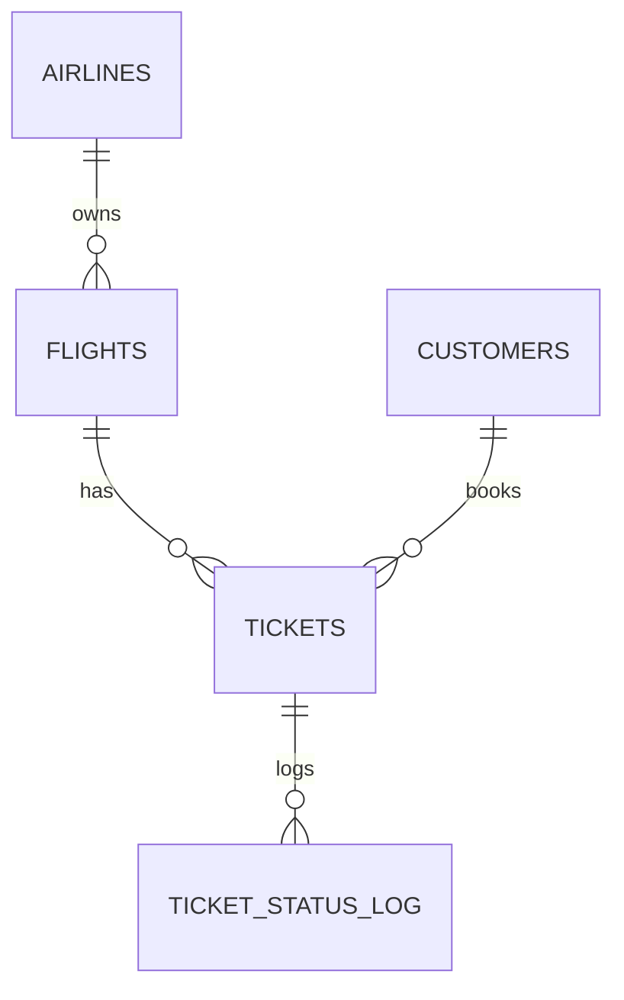

# ✈️ PlaneTickets_courseDesign | 蓝天航空机票预订系统

<div align="center">


<p>🎓 一个基于 Spring Boot 3 + Vue 2 的前后端分离架构机票预订系统课程设计</p>
<p>实现了从航班查询、动态定价、在线选座、订单支付到退改签的全流程业务闭环。</p>

</div>

---

## 📖 项目概述

本项目模拟了真实的航空公司票务系统，旨在解决高并发下的机票预订问题。系统分为**客户端（C端）**和**管理端（B端）**。

*   **客户端**：为旅客提供流畅的购票体验，支持多维度航班搜索、会员差异化定价、订单管理等功能。
*   **管理端**：为运营人员提供航班调度、票务管理、销售数据分析看板等功能。

### 核心亮点
*   🔥 **无状态认证**：基于 Spring Security + JWT 实现安全的身份验证与鉴权。
*   💰 **动态定价引擎**：根据舱位剩余、距离起飞时间、会员等级自动计算最优票价（策略模式实现）。
*   🔒 **并发安全**：使用数据库悲观锁（`@Lock(LockModeType.PESSIMISTIC_WRITE)`）解决高并发下的超卖问题。
*   📊 **数据可视化**：通过 JPQL 聚合查询实现多维度的销售报表统计。

---

## 🏗️ 系统架构

### 1. 技术选型

| 模块 | 技术/工具 | 版本 | 说明 |
| :--- | :--- | :--- | :--- |
| **后端** | Spring Boot | 3.3.0 | 核心容器与MVC框架 |
| | Spring Security | 6.x | 安全认证与授权 |
| | Spring Data JPA | - | ORM 持久层框架 |
| | JWT (jjwt) | 0.11.5 | Token 生成与解析 |
| | Lombok | - | 代码简化工具 |
| **前端** | Vue.js | 2.6.14 | 渐进式前端框架 |
| | Vue Router | 3.5.x | 前端路由管理 |
| | Element UI | 2.15.x | 桌面端组件库 |
| | Axios | 0.2x | HTTP 客户端 |
| **数据** | MySQL | 8.0+ | 关系型数据库 |


---
### 2. 后端代码结构

后端代码位于 `backend/Regular_customer_service` 目录下，遵循标准的 Maven 项目结构。

```text
backend/
└── Regular_customer_service/    # 后端项目根目录
    ├── pom.xml                  # Maven 依赖配置
    └── src/
        └── main/
            ├── resources/       # 配置文件 (application.properties, SQL脚本等)
            └── java/
                └── com/
                    └── bighomework/
                        └── planeTicketWeb/
                            ├── PlaneTicketWebApplication.java  # [启动类] Spring Boot入口
                            │
                            ├── config/                         # [配置层] SecurityConfig, CORS配置
                            ├── controller/                     # [控制层] 处理HTTP请求 (FlightController, BookingController等)
                            ├── dto/                            # [数据传输对象] requestDTO, responseDTO
                            ├── entity/                         # [实体层] 与数据库表对应的实体类 (Ticket, Flight等)
                            ├── enums/                          # [枚举] 状态、舱位等级等枚举定义
                            ├── exception/                      # [异常处理] 全局异常捕获与自定义异常
                            ├── repository/                     # [持久层] Spring Data JPA 接口
                            ├── security/                       # [安全组件] JWT过滤器、用户认证逻辑
                            ├── service/                        # [业务层] 核心业务逻辑接口与实现
                            └── util/                           # [工具类] 通用工具 (ApiResponse等)
```

### 3. 前端代码结构

前端代码位于 `frontend` 目录下，基于 Vue CLI 构建。

```text
frontend/
├── package.json                # 项目依赖与脚本配置
├── vue.config.js               # Vue CLI 配置文件 (代理、端口等)
└── src/
    ├── main.js                 # [入口文件] 初始化Vue实例、引入Element UI等
    ├── App.vue                 # [根组件] 页面主入口
    │
    ├── api/                    # [API层] Axios封装与后端接口调用方法
    ├── assets/                 # [静态资源] 图片、全局CSS样式
    ├── components/             # [组件层] 可复用的UI组件 (FlightList, OrderCard等)
    ├── router/                 # [路由层] 页面路由配置与权限守卫
    ├── store/                  # [状态管理] 简易的状态存储 (User, Token)
    └── views/                  # [视图层] 各个功能页面的完整视图 (HomeView, MyOrdersView等)
```

---
## ✨ 功能模块详解

### ✈️ 航班业务 (Flight Service)
*   **多模式搜索**：支持按“出发地-目的地-日期”搜索，或按“航班号”精确/模糊搜索。
*   **航班动态**：实时查询航班状态（计划/延误/取消），无需登录即可访问。
*   **数据联查**：使用 `JOIN FETCH` 优化 JPA 查询，避免 N+1 问题。

### 🎫 订票与订单 (Booking Service)
*   **创建订单**：
    *   校验航班余票（数据库锁）。
    *   调用 `PricingStrategy` 计算基准价格。
    *   应用会员折扣（普通/银卡/金卡/白金）。
    *   批量生成 `Ticket` 记录（原子性事务）。
*   **我的行程**：
    *   逻辑聚合：将同一时间预订的多张机票聚合为一个“逻辑订单”展示。
    *   状态追踪：显示待支付、已支付、已出行等状态。
*   **在线退票**：
    *   规则校验：检查是否起飞前、是否已支付。
    *   状态更新：更新 `tickets` 表状态，触发日志记录。

### 🛡️ 管理员后台 (Admin Dashboard)
*   **航班维护**：对 `flights` 表进行 CRUD 操作。
*   **销售报表**：
    *   按航线/航司统计销售额（JPQL 聚合查询）。
    *   客户画像分析（性别/年龄分布）。
*   **权限控制**：基于 `@PreAuthorize("hasRole('ADMIN')")` 的细粒度方法级安全控制。

---

## 💾 数据库设计 (Schema)

数据库名：`planetickets`

### 核心表关系图



### 关键表结构说明

1.  **`flights` (航班表)**：包含 `economy_seats`, `business_seats` (库存), `base_price` (基准价)。
2.  **`tickets` (机票表)**：本系统去除了冗余的 `orders` 表，直接使用 `tickets` 表记录每张票的信息。通过 `booking_time` 和 `flight_number` 在业务层逻辑聚合为“订单”。
3.  **`customers` (用户表)**：存储用户认证信息及 `membership_level` (会员等级)。

*(详细 SQL 建表语句请参考项目根目录下的 `sql/init.sql` 或上文数据库设计章节)*

---

## 🚀 快速开始

### 1. 前置准备
*   JDK 17+
*   Node.js 16+
*   MySQL 8.0+

### 2. 数据库初始化
在 MySQL 中执行建表脚本，并导入初始数据（航空公司、航班、测试用户）。

### 3. 后端启动
修改 `src/main/resources/application.properties`：
```properties
spring.datasource.username=root
spring.datasource.password=你的密码
# JWT 密钥 (生产环境请修改)
app.jwt.secret=YourSecretKey...
```
在 `backend` 目录下运行：
```bash
mvn clean spring-boot:run
```

### 4. 前端启动
在 `frontend` 目录下运行：
```bash
# 安装依赖 (已解决 async-validator 兼容问题)
npm install

# 启动开发服务器
npm run serve
```
访问 `http://localhost:8081` 即可体验。

---

## ❓ 常见问题 (FAQ)

**Q: 为什么注册时提示“服务内部错误”但控制台没有 SQL 日志？**
A: 这通常是 Spring Validation 在 Controller 层拦截了请求。请检查前端发送的 JSON 数据（如 `password` 长度、`phone` 格式）是否符合 DTO 中的 `@Valid` 规则。

**Q: 后端报错 `NullPointerException` 在 Service 层？**
A: 请检查是否使用了 Lombok 的 `@RequiredArgsConstructor` 但 IDE 没有安装 Lombok 插件，导致依赖注入失败。建议使用 IDEA 或手动编写构造函数。

**Q: 前端登录后刷新页面状态丢失？**
A: 本项目是个 Demo，Token 存储在 `localStorage`。请确保 `App.vue` 或 `store/index.js` 中有从本地存储恢复状态的逻辑。

---

<div align="center">

**如果这个项目对你有帮助，请给一个 ⭐️ Star！**

<sub>Designed by AndyXuPrime | 2025-2026 课程设计</sub>
</div>