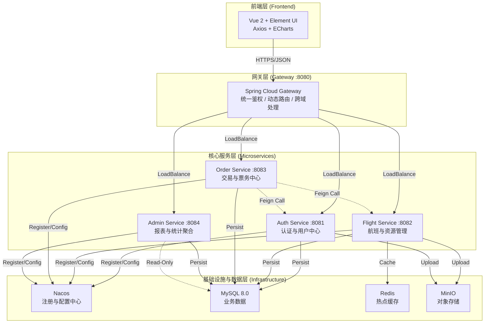
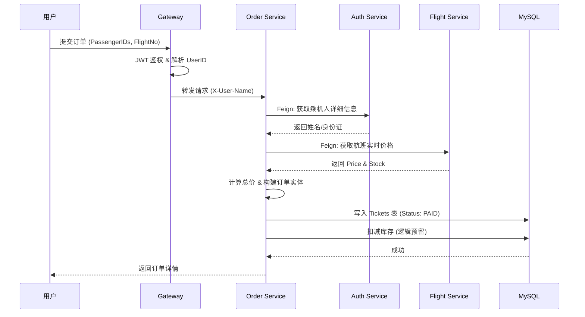
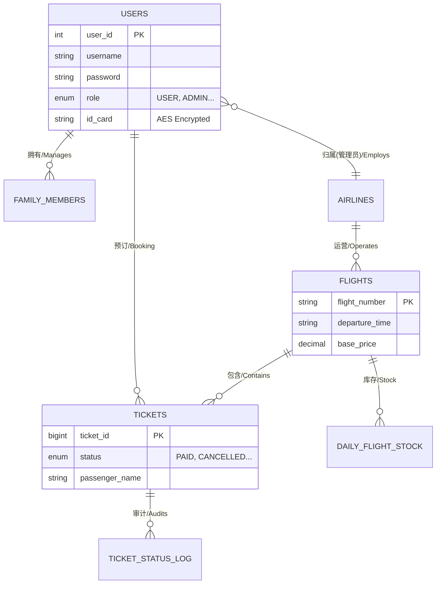

# ✈️ 蓝天航空 (BlueSky Airlines) | 分布式机票预订系统

[](https://openjdk.org/)
[](https://spring.io/projects/spring-cloud-alibaba)
[](https://vuejs.org/)
[](https://www.mysql.com/)
[](https://redis.io/)
[](https://min.io/)

> 一个基于 **Spring Cloud Alibaba** 微服务架构的现代化机票预订平台。系统采用前后端分离设计，融合了 **结构主义** 与 **复古未来** 的视觉风格，实现了从航班查询、动态定价、一单多票预订到后台数据可视化的完整业务闭环。

---

## ✨ 核心特性

### 🧑‍✈️ 用户端 (Client Side)
- **🚀 极速航班查询** - 集成 **Redis** 缓存，热点航线查询毫秒级响应。
- **🎫 一单多票预订** - 支持一次性为本人及多位常用乘机人购票，智能解析身份信息。
- **💰 动态定价引擎** - 基于舱位、时间、库存因子的实时票价计算策略。
- **🛡️ 全链路安全** - 密码 **BCrypt** 加密，身份证号 **AES** 对称加密存储。
- **☁️ 个人中心** - 集成 **MinIO** 对象存储，支持头像上传与回显；管理常用乘机人。

### 👨‍💻 管理端 (Admin Side)
- **📊 数据仪表盘** - 集成 **ECharts**，实时展示营收趋势、订单量及会员分布（双Y轴结构主义图表）。
- **🔐 RBAC 权限控制** - 平台管理员与航司管理员权限隔离，数据互不可见。
- **📢 系统广播** - 管理员发布全员通知，前端实时接收。
- **✈️ 航班调度** - 航班增删改查，修改票价自动清除 Redis 缓存。
- **📝 审计日志** - 订单核销、退票等关键操作全流程记录。

---

## 🏗️ 系统架构

### 微服务架构图



### 核心业务流程：机票预订



---

## 🛠️ 技术栈

### 后端 (Backend)

| 组件 | 版本 | 说明 |
| :--- | :--- | :--- |
| **Spring Boot** | 3.2.5 | 核心框架 |
| **Spring Cloud Alibaba** | 2023.0.1.0 | 微服务全家桶 |
| **Nacos** | 2.3.2 | 服务注册与配置中心 |
| **OpenFeign** | 4.x | 声明式服务调用 |
| **Gateway** | 4.x | 响应式网关 (WebFlux) |
| **Spring Data JPA** | 3.x | ORM 框架 |
| **MinIO SDK** | 8.5 | 对象存储客户端 |

### 前端 (Frontend)

| 组件 | 版本 | 说明 |
| :--- | :--- | :--- |
| **Vue.js** | 2.7 | 渐进式 JavaScript 框架 |
| **Element UI** | 2.15 | 桌面端组件库 (深度定制样式) |
| **Axios** | 1.6 | HTTP 客户端 |
| **ECharts** | 5.5 | 数据可视化库 |
| **Vue Router** | 3.6 | 路由管理 |

---

## 🚀 快速开始

### 1. 环境准备
*   **JDK**: 17+
*   **Maven**: 3.8+
*   **Node.js**: 16+
*   **MySQL**: 8.0
*   **Redis**: 7.x
*   **Nacos**: 2.x (Standalone)
*   **MinIO**: RELEASE.2023+

### 2. 基础设施启动
```bash
# 1. 启动 Nacos
startup.cmd -m standalone

# 2. 启动 Redis
redis-server.exe

# 3. 启动 MinIO (访问 :9001 创建 bucket 'avatars')
minio.exe server D:\data --console-address ":9001"
```

### 3. 后端微服务启动
> **⚠️ 注意**：启动前请确保 Nacos 配置列表已导入所有服务的 `yaml` 文件。

```bash
# 1. 安装公共依赖 (必须步骤！)
mvn clean install -DskipTests

# 2. 启动微服务 (推荐顺序: Auth -> Flight -> Order -> Admin -> Gateway)
# 可在 IDE 中批量启动，或在各子模块下执行:
mvn spring-boot:run
```
### 4. 前端启动
```bash
cd frontend
npm install
npm run serve
# 访问 http://localhost:8085
```

---

## ✨ 核心功能

### 🧑‍✈️ 客户端 (Client Side) - 极致的购票体验

面向普通乘客，提供从搜索到出行的全流程服务。

- **🚀 高性能航班搜索**
    - 支持多维度检索（出发地/目的地/日期/航司）。
    - **技术亮点**：集成 **Redis** 缓存策略，热点航线查询响应时间 **< 20ms**，有效削减数据库负载。
- **🎫 一单多票智能预订**
    - 支持单次订单为本人及多位“常用乘机人”购票。
    - **技术亮点**：前端智能解析乘机人身份，后端通过 **OpenFeign** 跨服务拉取实名信息，实现分布式数据聚合。
- **💰 动态定价引擎**
    - 摒弃固定票价，实时计算最优价格。
    - **策略模型**：`最终价 = 基础价 × 舱位系数(经济/商务) × 时间因子(早鸟/临期) × 库存因子(紧俏程度)`。
- **🛡️ 个人中心与安全**
    - 支持头像上传（对接 **MinIO** 对象存储）与资料修改。
    - **隐私保护**：全链路加密，密码采用 **BCrypt** 哈希，身份证号采用 **AES** 对称加密存储。
- **📦 订单全生命周期管理**
    - 支持订单详情查看、支付模拟及在线退票。
    - **状态流转**：`已预订` → `已支付` → `已使用` / `已取消`，状态变更实时反馈。

### 👨‍💻 管理端 (Admin Side) - 专业的运营驾驶舱

面向平台运营人员与航空公司，提供数据决策与资源调度能力。

- **📊 可视化数据仪表盘**
    - **结构主义设计**：采用双 Y 轴 **ECharts** 图表，直观展示“营收金额”与“订单量”趋势。
    - **实时监控**：动态展示今日新增用户、活跃度及会员等级分布（饼图）。
- **🔐 多租户 RBAC 权限体系**
    - **平台超级管理员**：拥有上帝视角，可管理所有航司、审核入驻申请、发布全员系统广播。
    - **航司管理员**：**数据隔离**，仅能增删改查**本航空公司**旗下的航班与报表，严防数据越权。
- **✈️ 航班资源调度**
    - 支持航班的发布、停飞及基础票价调整。
    - **缓存一致性**：修改航班信息后，自动触发 `@CacheEvict` 清除 Redis 缓存，确保用户端数据实时同步。
- **📝 票务审计与核销**
    - **登机核销**：模拟机场柜台操作，管理员后台确认登机。
    - **审计日志**：每一次状态变更（如退票、核销）均会被记录在审计表中（操作人、时间、变更前/后状态），有据可查。

---
## 🗄️ 数据库设计

本系统采用 MySQL 8.0 作为核心数据存储，遵循第三范式设计，并针对微服务架构进行了逻辑拆分与性能优化。

### 🔗 实体关系图 (ER Diagram)



### 📋 核心表结构

#### 1. 用户与权限中心 (Auth & User)

```sql
-- 用户表 (核心鉴权)
users (
    user_id INT PRIMARY KEY AUTO_INCREMENT,
    phone VARCHAR(20) UNIQUE NOT NULL,      -- 登录账号
    password VARCHAR(255) NOT NULL,         -- BCrypt 加密存储
    role ENUM('ROLE_USER', 'ROLE_PLATFORM_ADMIN', 'ROLE_AIRLINE_ADMIN'),
    airline_code CHAR(2),                   -- 仅航司管理员有效，实现数据隔离
    status ENUM('PENDING', 'ACTIVE'),       -- 审核状态
    id_card VARCHAR(255),                   -- AES 对称加密存储
    avatar_url VARCHAR(255)                 -- MinIO 对象存储地址
)

-- 常用乘机人表
family_members (
    member_id INT PRIMARY KEY,
    user_id INT NOT NULL,                   -- 关联主账号
    name VARCHAR(50),
    id_card VARCHAR(255)                    -- AES 加密
)
```

#### 2. 航班与资源中心 (Flight & Resource)

```sql
-- 航班基础信息表
flights (
    flight_number VARCHAR(6) PRIMARY KEY,   -- 如 CA1886
    airline_code CHAR(2) NOT NULL,
    departure_airport VARCHAR(50),
    arrival_airport VARCHAR(50),
    departure_time TIME,
    base_price DECIMAL(10,2)                -- 动态定价的基准价格
)

-- 每日航班库存表 (核心优化)
-- 用于解耦交易与查询，避免高并发下对订单表的 Count 操作
daily_flight_stock (
    id BIGINT PRIMARY KEY,
    flight_number VARCHAR(6),
    flight_date DATE,
    economy_stock INT,                      -- 经济舱实时余票
    business_stock INT,                     -- 商务舱实时余票
    UNIQUE KEY (flight_number, flight_date)
)

-- 航空公司表
airlines (
    airline_code CHAR(2) PRIMARY KEY,
    airline_name VARCHAR(50),
    logo_url VARCHAR(255)                   -- MinIO 地址
)
```

#### 3. 订单与交易中心 (Order & Trade)

```sql
-- 机票订单表
tickets (
    ticket_id BIGINT PRIMARY KEY,
    user_id INT NOT NULL,                   -- 下单人
    flight_number VARCHAR(6),
    flight_date DATE,
    passenger_name VARCHAR(50),             -- 实际乘机人快照
    class ENUM('经济舱', '商务舱'),
    price DECIMAL(10,2),                    -- 实付金额
    status ENUM('已预订', '已支付', '已取消', '已使用'),
    booking_time TIMESTAMP,                 -- 用于聚合逻辑订单
    payment_time TIMESTAMP
)

-- 订单状态变更日志 (审计追踪)
ticket_status_log (
    log_id INT PRIMARY KEY,
    ticket_id BIGINT,
    old_status ENUM,
    new_status ENUM,
    change_time TIMESTAMP,
    changed_by VARCHAR(50)                  -- 操作人 (用户或管理员)
)
```

### ⚙️ 关键设计逻辑

系统通过数据库设计与应用层逻辑配合，解决了以下核心问题：

- **🚀 库存解耦 (Inventory Decoupling)**
    - 引入 `daily_flight_stock` 表，将库存查询从 `tickets` 订单表中剥离。
    - **优势**：Flight 服务查询余票时无需跨服务调用 Order 服务进行全表 `COUNT(*)`，将热点查询复杂度从 O(N) 降为 O(1)。

- **🛡️ 数据隔离 (Data Isolation)**
    - `users` 表中的 `airline_code` 字段配合后端的拦截器，实现了多租户级别的数据隔离。
    - **效果**：航司管理员登录后，SQL 层自动注入过滤条件，确保其只能访问自己公司的航班与报表数据。

- **🔒 隐私加密 (Privacy Encryption)**
    - `id_card` 字段在数据库中存储为 AES 加密后的 Base64 字符串。
    - 即使数据库泄露，攻击者也无法还原用户的真实身份证信息。

- **📝 完整审计 (Audit Trail)**
    - 任何对订单状态的修改（支付、退票、核销）都会触发 `ticket_status_log` 的写入。
    - 实现了业务操作的可追溯性，满足金融级交易系统的合规要求。

---
## 📁 项目结构

```text
plane-ticket-cloud/
├── common-module/          # [公共模块] DTO, Enums, Utils, Feign接口
├── gateway-service/        # [网关服务] :8080 | 鉴权, 路由, 限流
├── auth-service/           # [认证服务] :8081 | 用户, 权限, 乘机人
├── flight-service/         # [航班服务] :8082 | 航班, 航司, 定价, 文件
├── order-service/          # [订单服务] :8083 | 交易, 订单, 审计
├── admin-service/          # [后台服务] :8084 | 统计, 报表, 广播
└── frontend/               # [前端项目] Vue CLI, Element UI
```

---

## 🐛 技术攻坚与踩坑记录

在微服务重构过程中，我们解决了以下关键技术难题：

1.  **Maven 依赖地狱**：
    *   *问题*：子服务找不到 `common-module` 类。
    *   *解决*：建立 `mvn clean install` 标准规范，确保本地仓库版本一致。
2.  **跨服务鉴权死锁 (403 Loop)**：
    *   *问题*：Order 服务调用 Auth 服务获取用户信息时被拦截。
    *   *解决*：在 Auth 服务中开辟 `/internal/**` 白名单接口，仅供 Feign 内部调用。
3.  **网关 CORS 与 WebFlux 冲突**：
    *   *问题*：前端跨域报错，且 Gateway 启动失败。
    *   *解决*：移除 Servlet 依赖，使用 `AuthGlobalFilter` (Reactive) 替代传统 Filter；配置 `allowedOriginPatterns: "*"`。
4.  **Jackson 无限递归序列化**：
    *   *问题*：`Flight` 与 `Airline` 双向关联导致 StackOverflow。
    *   *解决*：使用 `@JsonIgnoreProperties` 切断序列化链路。
5.  **数据一致性与防崩设计**：
    *   *策略*：在 `TicketServiceImpl` 中加入大量 `Optional` 判空保护，确保即使某个微服务返回数据异常，主流程也能兜底运行（如显示“未知航司”而非报错）。

---

## 🎨 界面展示

### 界面设计思路、逻辑与细节

本系统的界面设计摒弃了传统后台管理系统千篇一律的扁平化风格，确立了**“结构主义（Structuralism）”与“复古未来（Retro-Futurism）”相结合**的设计语言。旨在通过硬朗的线条、高对比度的色彩和精密的数据可视化，为用户营造一种**“航空驾驶舱”**般的专业操作体验。

#### 1. 设计思路 (Design Philosophy)
*   **秩序与功能至上**：遵循结构主义美学，强调界面的几何感与模块化。通过粗线条边框（Border）和明显的区块分割，将复杂的信息（如航班时刻、财务报表）梳理得井井有条，减少用户的认知负荷。
*   **品牌基因植入**：提取航空业的经典元素，确立了以**静谧蓝 (#82B1B7)** 为主色调（代表天空与安全），**琥珀金 (#DCC87F)** 为高光色（代表尊贵服务），**深灰 (#1a1a1a)** 为骨架色的视觉体系，传达出稳重、可靠的品牌形象。
*   **沉浸式数据体验**：针对管理端，设计理念从“表格罗列”转向“数据叙事”。利用 ECharts 可视化引擎，将枯燥的销售数据转化为动态的趋势图与分布图，辅助管理员快速决策。

#### 2. 交互逻辑 (Interaction Logic)
*   **线性与闭环（客户端）**：
    *   面向乘客的交互设计遵循“线性引导”原则：**搜索 $\rightarrow$ 选择 $\rightarrow$ 填单 $\rightarrow$ 支付**。
    *   在“一单多票”场景中，采用动态表单逻辑，用户勾选乘机人后，右侧价格栏实时联动计算总价，给予即时的反馈闭环。
*   **全局与钻取（管理端）**：
    *   面向管理员采用“总分结构”。首页（Dashboard）提供上帝视角的全平台概览；点击具体模块（如航班管理）则进入详细的 CRUD 操作区。
    *   引入**RBAC 视图控制**，不同角色的管理员看到的菜单项和操作按钮动态渲染，确保越权操作在 UI 层即被物理隔绝。
*   **状态可视化**：
    *   对于订单状态（已支付、已取消），不再仅显示文字，而是通过不同颜色的**呼吸灯标签（Pulse Tag）**进行区分，利用视觉条件反射提高识别效率。

#### 3. 设计细节 (Visual Details)
*   **硬核结构风格**：
    *   **实色阴影**：弃用 CSS 的模糊阴影，改用 `box-shadow: 6px 6px 0 rgba(...)` 的实色偏移阴影，配合 `2px` 的粗黑边框，营造出类似实体卡片或工程蓝图的层级感。
    *   **微交互动效**：当鼠标悬停在卡片上时，通过 `transform: translate(-2px, -2px)` 实现“悬浮吸附”效果，模拟物理按键的触感。
*   **精密排版系统**：
    *   **字体分级**：标题和说明文案使用无衬线字体（Sans-serif）保证易读性；而金额、日期、航班号等关键数据，强制使用 **Consolas** 等宽字体，模拟旧式计算机终端的显示效果，强化数据的严谨性。
    *   **装饰元素**：在卡片四角添加了微小的“螺丝钉”装饰点，在模块间增加了“连接线”设计，进一步强化了系统的工程美学。
*   **双轴图表设计**：
    *   在营收趋势图中，采用了**双 Y 轴**设计。左轴对应“金额”（万级），右轴对应“单量”（十级），有效解决了不同量级数据在同一图表中显示被压缩的问题，确保数据展示的科学性。
---

*   **开发者**: AndyXuPrime
*   **版本**: V 1.0.0 (Microservices Edition)

<div align="center">
    <strong>Designed with ❤️ for High Concurrency & Scalability</strong>

**如果这个项目对你有帮助，请给我一个 ⭐️**
</div>