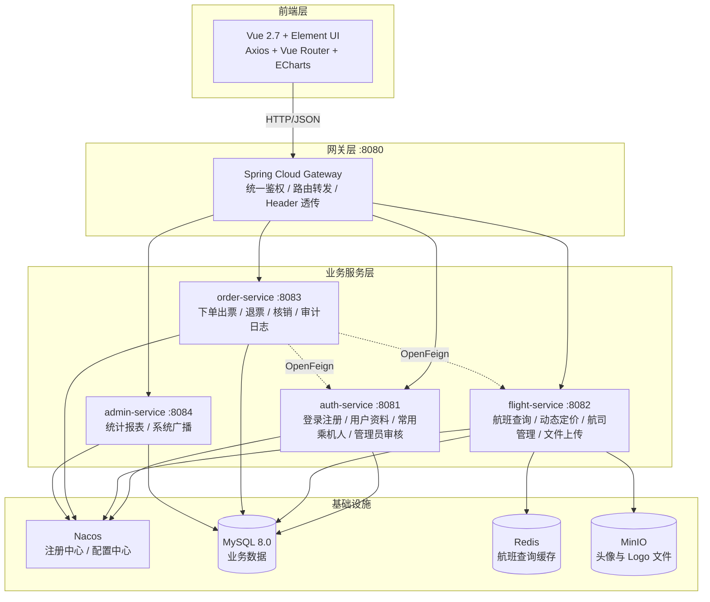
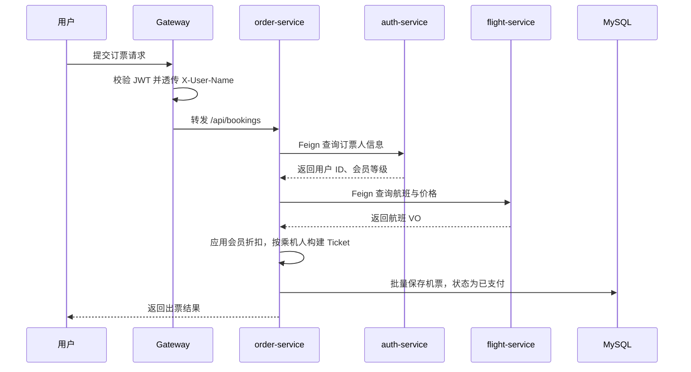
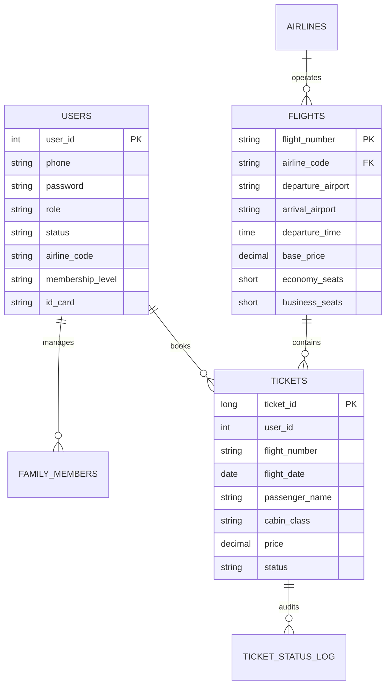

# 航空机票预订系统 | Spring Cloud Alibaba 全栈微服务项目

[](https://openjdk.org/)
[](https://spring.io/projects/spring-boot)
[](https://spring.io/projects/spring-cloud-alibaba)
[](https://vuejs.org/)
[](https://www.mysql.com/)
[](https://redis.io/)
[](https://min.io/)

一个面向课程设计与简历展示的全栈项目：前端基于 Vue 2 + Element UI，后端基于 Spring Boot 3 + Spring Cloud Alibaba，拆分为网关、认证、航班、订单、后台统计等服务，实现航班查询、动态定价、一单多票、订单退票/核销、管理员审核、航班调度、系统广播与统计报表等业务闭环。

> 当前仓库以代码为准：`backend` 根 `pom.xml` 聚合了 `common-module`、`auth-service`、`flight-service`、`order-service`、`gateway-service`；`admin-service` 在当前版本中可单独构建和启动。

---

## 简历亮点

- **微服务架构实践**：使用 Spring Cloud Gateway + Nacos + OpenFeign 搭建服务注册、配置管理、统一网关鉴权和跨服务调用链路。
- **完整交易链路**：实现从航班搜索、乘机人选择、下单出票、订单查询、退票到管理员核销的机票业务闭环。
- **权限与安全设计**：基于 JWT 的无状态认证，Gateway 统一解析 Token 并向下游透传用户角色；密码使用 BCrypt，身份证号使用 AES 加密存储。
- **性能与可维护性**：航班搜索接入 Redis 缓存，航班调价/发布后清理缓存；公共 DTO、枚举、Feign 接口沉淀在 `common-module`。
- **管理后台能力**：支持平台管理员与航司管理员角色区分，提供航班调度、航司管理、入驻审核、用户管理、票务中心、系统广播和 ECharts 数据看板。
- **前端工程化**：使用 Vue Router 路由守卫、Axios 拦截器、Vue.observable 轻量状态管理，并封装可复用搜索、订单、登录注册、航班状态组件。

---

## 功能概览

### 用户端

- **航班查询**：支持按航线或航空公司检索航班，展示起降时间、余票、舱位和动态价格。
- **一单多票**：一次订单可为本人或多位常用乘机人购票，后端按乘机人生成多张 `Ticket` 记录。
- **会员折扣**：订单服务根据用户会员等级（普通/银卡/金卡/白金）计算最终票价。
- **我的行程**：按预订时间和航班聚合展示逻辑订单，支持已支付机票退票。
- **个人中心**：支持资料维护、密码修改、头像 URL 更新、常用乘机人增删。
- **航班动态与客户服务**：提供航班号查询、服务说明和常见问题页面。

### 管理端

- **登录与入驻审核**：航司管理员注册后进入 `PENDING` 状态，由平台管理员审核为 `ACTIVE`。
- **航班调度**：平台管理员可管理全量航班，航司管理员仅能管理自己航司下的航班。
- **航司管理**：维护航空公司基础信息与 Logo。
- **票务中心**：支持按航班号、机票状态检索订单，办理登机核销，并查看状态变更日志。
- **用户管理**：查询用户、调整会员等级、重置用户密码。
- **系统广播**：平台管理员发布公共消息，用户端拉取展示。
- **数据看板**：后台服务提供总营收、热门航线等聚合接口，前端使用 ECharts 展示趋势图、饼图和柱状图。

---

## 系统架构


```mermaid
graph TB
    subgraph Frontend["前端层"]
        V[Vue 2.7 + Element UI<br/>Axios + Vue Router + ECharts]
    end

    subgraph Gateway["网关层 :8080"]
        G[Spring Cloud Gateway<br/>统一鉴权 / 路由转发 / Header 透传]
    end

    subgraph Services["业务服务层"]
        A[auth-service :8081<br/>登录注册 / 用户资料 / 常用乘机人 / 管理员审核]
        F[flight-service :8082<br/>航班查询 / 动态定价 / 航司管理 / 文件上传]
        O[order-service :8083<br/>下单出票 / 退票 / 核销 / 审计日志]
        M[admin-service :8084<br/>统计报表 / 系统广播]
    end

    subgraph Infra["基础设施"]
        N[Nacos<br/>注册中心 / 配置中心]
        DB[(MySQL 8.0<br/>业务数据)]
        R[(Redis<br/>航班查询缓存)]
        S[(MinIO<br/>头像与 Logo 文件)]
    end

    V -->|HTTP/JSON| G
    G --> A
    G --> F
    G --> O
    G --> M
    A & F & O & M --> N
    A & F & O & M --> DB
    F --> R
    F --> S
    O -.->|OpenFeign| A
    O -.->|OpenFeign| F
```

### 核心下单流程


```mermaid
sequenceDiagram
    participant U as 用户
    participant G as Gateway
    participant O as order-service
    participant A as auth-service
    participant F as flight-service
    participant DB as MySQL

    U->>G: 提交订票请求
    G->>G: 校验 JWT 并透传 X-User-Name
    G->>O: 转发 /api/bookings
    O->>A: Feign 查询订票人信息
    A-->>O: 返回用户 ID、会员等级
    O->>F: Feign 查询航班与价格
    F-->>O: 返回航班 VO
    O->>O: 应用会员折扣，按乘机人构建 Ticket
    O->>DB: 批量保存机票，状态为已支付
    O-->>U: 返回出票结果
```

---

## 技术栈

### 后端

| 组件 | 当前版本/实现 | 用途 |
| :--- | :--- | :--- |
| Java | 17+ | 后端开发语言 |
| Spring Boot | 3.2.5 | 微服务基础框架 |
| Spring Cloud | 2023.0.1 | Gateway、OpenFeign、LoadBalancer |
| Spring Cloud Alibaba | 2023.0.1.0 | Nacos 注册与配置 |
| Spring Data JPA | 3.x | ORM 与 Repository |
| Spring Security | 6.x | 登录认证、密码加密、服务安全配置 |
| JJWT | 0.11.5 | JWT 生成与解析 |
| MySQL | 8.0 | 业务数据持久化 |
| Redis | 由运行环境提供 | 航班搜索缓存 |
| MinIO SDK | 8.5.7 | 文件上传与对象存储 |

### 前端

| 组件 | 当前版本 | 用途 |
| :--- | :--- | :--- |
| Vue | 2.7.16 | 前端框架 |
| Vue Router | 3.6.5 | 页面路由与权限守卫 |
| Element UI | 2.15.14 | UI 组件库 |
| Axios | 1.6.7 | HTTP 请求与拦截器 |
| ECharts | 6.0.0 | 管理端数据可视化 |
| Font Awesome | 6.5.1 | 图标资源 |

---

## 项目结构

```text
PlaneTickets_courseDesign-main/
├── backend/
│   ├── pom.xml                 # Maven 父工程，统一依赖版本
│   ├── common-module/          # 公共 DTO、枚举、异常、JWT、加密工具、Feign 接口
│   ├── gateway-service/        # 网关服务 :8080
│   ├── auth-service/           # 认证与用户服务 :8081
│   ├── flight-service/         # 航班与航司服务 :8082
│   ├── order-service/          # 订单与票务服务 :8083
│   └── admin-service/          # 后台统计与消息服务 :8084
├── frontend/                   # Vue CLI 前端项目
├── files/                      # 课程设计说明、阶段方案与总结文档
└── README.md
```

---

## 模块说明

| 模块 | 主要职责 | 关键实现 |
| :--- | :--- | :--- |
| `common-module` | 跨服务公共依赖 | `ApiResponse`、业务枚举、请求/响应 DTO、`JwtTokenProvider`、`EncryptionUtils`、Feign Client |
| `gateway-service` | 统一入口 | `AuthGlobalFilter` 校验 JWT，向下游注入 `X-User-Name`、`X-User-Role`、`X-Airline-Code` |
| `auth-service` | 用户中心 | 登录注册、资料修改、密码修改、常用乘机人、管理员审核、会员等级维护 |
| `flight-service` | 航班中心 | 航班搜索、动态定价、航司管理、航班发布、票价修改、Redis 缓存、MinIO 上传 |
| `order-service` | 交易中心 | 下单出票、会员折扣、我的行程、退票、管理员核销、状态审计日志 |
| `admin-service` | 后台聚合 | 总营收、热门航线、客户/航线分析接口、系统广播消息 |
| `frontend` | 用户端与管理端界面 | 路由守卫、Axios 封装、登录注册弹窗、订单卡片、管理后台子页面、ECharts 图表 |

---

## 数据库设计

当前代码中的主要实体表如下：

| 表 | 对应模块 | 说明 |
| :--- | :--- | :--- |
| `users` | `auth-service` | 用户、管理员、角色、审核状态、航司绑定、会员等级、头像 |
| `family_members` | `auth-service` | 常用乘机人，归属于用户 |
| `airlines` | `flight-service` | 航空公司基础信息和 Logo |
| `flights` | `flight-service` | 航班号、航司、机场、起降时间、机型、舱位座位数、基础票价 |
| `tickets` | `order-service` | 物理机票记录，包含乘机人快照、舱位、票价、状态和时间 |
| `ticket_status_log` | `order-service` | 退票、核销等状态变更审计 |
| `system_messages` | `admin-service` | 平台广播消息 |


```mermaid
erDiagram
    USERS ||--o{ FAMILY_MEMBERS : manages
    USERS ||--o{ TICKETS : books
    AIRLINES ||--o{ FLIGHTS : operates
    FLIGHTS ||--o{ TICKETS : contains
    TICKETS ||--o{ TICKET_STATUS_LOG : audits

    USERS {
        int user_id PK
        string phone
        string password
        string role
        string status
        string airline_code
        string membership_level
        string id_card
    }

    FLIGHTS {
        string flight_number PK
        string airline_code FK
        string departure_airport
        string arrival_airport
        time departure_time
        decimal base_price
        short economy_seats
        short business_seats
    }

    TICKETS {
        long ticket_id PK
        int user_id
        string flight_number
        date flight_date
        string passenger_name
        string cabin_class
        decimal price
        string status
    }
```

---

## 接口地图

| 服务 | 代表接口 |
| :--- | :--- |
| 认证服务 | `POST /api/auth/login`、`POST /api/auth/register`、`PUT /api/auth/user/profile`、`GET /api/auth/family`、`PUT /api/auth/admin/audit` |
| 航班服务 | `GET /api/flights/search`、`GET /api/flights/all`、`GET /api/flights/status`、`GET /api/flights/admin/list`、`POST /api/flights`、`PUT /api/flights/{flightNumber}/price` |
| 航司/文件 | `GET /api/airlines`、`POST /api/airlines`、`PUT /api/airlines/{code}/logo`、`POST /api/files/upload` |
| 订单服务 | `POST /api/bookings`、`GET /api/bookings/my-tickets`、`POST /api/bookings/tickets/{ticketId}/refund`、`PUT /api/bookings/admin/tickets/{ticketId}/check-in` |
| 后台服务 | `GET /api/admin/dashboard/stats`、`POST /api/admin/messages/publish`、`GET /api/admin/messages/public`、`GET /api/admin/stats/route-analysis` |

---

## 快速开始

### 1. 环境准备

- JDK 17+
- Maven 3.8+
- Node.js 16+
- MySQL 8.0
- Redis
- Nacos 2.x
- MinIO

### 2. 启动基础设施

```bash
# 启动 Nacos standalone
startup.cmd -m standalone

# 启动 Redis
redis-server.exe

# 启动 MinIO，并按实际配置创建头像/Logo 使用的 bucket
minio.exe server D:\data --console-address ":9001"
```

> 各服务本地只保留 `bootstrap.yml` 作为 Nacos 寻址配置。启动前需要在 Nacos 中准备数据库、Redis、MinIO、JWT 等服务配置。

### 3. 构建后端

```bash
cd backend
mvn clean install -DskipTests

# admin-service 当前未纳入根 pom modules，可单独验证/启动
cd admin-service
mvn clean package -DskipTests
```

### 4. 启动服务

推荐启动顺序：

```text
auth-service -> flight-service -> order-service -> admin-service -> gateway-service
```

可在 IDE 中运行各服务启动类，也可进入对应子模块执行：

```bash
mvn spring-boot:run
```

### 5. 启动前端

```bash
cd frontend
npm install
npm run serve
```

前端开发服务端口在 `frontend/vue.config.js` 中配置为：

```text
http://localhost:8081
```

API 统一请求 `http://localhost:8080`，由 Gateway 转发到后端服务。

---

## 技术攻坚记录

1. **Gateway 与传统 Servlet Filter 不兼容**
   - 问题：Spring Cloud Gateway 基于 WebFlux，传统 Servlet 过滤器无法直接复用。
   - 处理：实现 `AuthGlobalFilter`，在响应式链路中完成 Token 校验和 Header 透传。

2. **跨服务调用被安全配置拦截**
   - 问题：Order 服务通过 Feign 调用 Auth/Flight 服务时，内部接口可能被认证拦截。
   - 处理：在服务安全配置中放行内部查询接口，并由 Gateway 承担外部请求鉴权。

3. **JPA 双向关联序列化问题**
   - 问题：`Flight` 与 `Airline` 关联对象序列化时容易出现循环引用或懒加载问题。
   - 处理：使用 `@JsonIgnoreProperties` 控制序列化边界，并在查询中按需要加载航司信息。

4. **公共模块版本不同步**
   - 问题：DTO 或 Feign 接口变更后，子服务仍引用本地仓库旧版本，可能出现字段为空或方法缺失。
   - 处理：形成“修改 `common-module` 后执行 `mvn clean install -DskipTests`”的开发规范。

5. **前端登录状态与路由守卫协同**
   - 问题：刷新页面后用户态丢失会导致管理端误跳转。
   - 处理：登录信息持久化到 `localStorage`，应用启动和路由守卫读取本地用户角色进行权限判断。

---

## 界面与交互设计

项目界面从普通表单型课程设计升级为具备品牌感的航空业务系统，主要采用结构化布局、清晰的状态标签和数据可视化组件：

- **用户端**：围绕“搜索 -> 选择 -> 填单 -> 出票/管理行程”的线性流程组织页面。
- **管理端**：采用侧边栏布局，按数据概览、航班调度、用户管理、票务中心、入驻审核、航司管理、消息发布拆分功能区。
- **视觉风格**：使用航空蓝、深灰、琥珀色作为主要视觉元素，配合硬朗边框、实色阴影、等宽数字字体，强化“运营驾驶舱”的专业感。
- **数据可视化**：在管理端 Dashboard 中使用 ECharts 展示趋势、分布和柱状图，辅助查看营收与热门航线等数据。

---

## 验证结果

已在当前仓库执行以下检查：

```bash
cd backend && mvn -q -DskipTests package
cd backend/admin-service && mvn -q -DskipTests package
cd frontend && npm run lint
```

结果：

- 后端根工程聚合模块构建通过。
- `admin-service` 单独构建通过。
- 前端 ESLint 检查通过。

---

## 后续可优化方向

- 将 `admin-service` 加入根 `pom.xml` 的 `<modules>`，使全量后端可一次性聚合构建。
- 补充数据库初始化 SQL 或 Flyway/Liquibase 迁移脚本，降低部署和演示成本。
- 为订单扣减库存引入更明确的库存表或库存锁策略，增强高并发场景下的一致性。
- 为核心服务补充单元测试和接口测试，沉淀可展示的测试报告。
- 增加 Docker Compose，一键启动 MySQL、Redis、Nacos、MinIO 和各微服务。

---

**开发者**：AndyXuPrime  
**版本**：V 1.0.0 (Microservices Edition)
